# RNN, LSTM, Seq2Seq, Teacher Forcing

## 1. Tổng Quan về Neural Network và RNN

Trước khi đi sâu vào RNN, hãy cùng nhìn lại cấu trúc cơ bản của Neural Network:

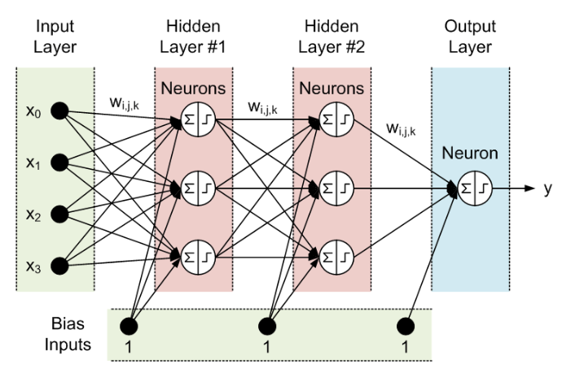

- **Neural Network** gồm 3 phần chính:
  - **Input Layer**
  - **Hidden Layer**
  - **Output Layer**

> Đầu vào và đầu ra của mạng neuron truyền thống là độc lập, không phù hợp với bài toán chuỗi như hoàn thành câu, mô tả,... vì dự đoán tiếp theo phụ thuộc vào vị trí trong chuỗi và các phần tử phía trước.

### Sự Ra Đời của RNN

RNN (Recurrent Neural Network) ra đời với ý tưởng **sử dụng bộ nhớ** để lưu lại thông tin từ các bước trước, từ đó giúp dự đoán chính xác hơn cho bước hiện tại.

#### Mô hình RNN

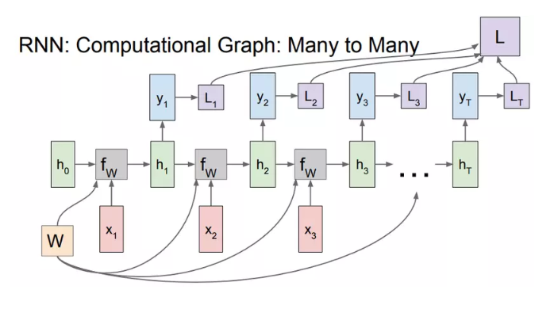

Giải thích một chút: Nếu như mạng Neural Network chỉ là input layer *x* đi qua hidden layer *h* và cho ra output layer *y* với *full connected* giữa các layer thì trong RNN, các input *xₜ* sẽ được kết hợp với hidden layer *hₜ₋₁* bằng hàm *fW* để tính toán ra hidden layer *hₜ* hiện tại và output *yₜ* sẽ được tính ra từ *hₜ*. *W* là tập các trọng số và nó được ở tất cả các cụm, các *L₁, L₂, ..., Lₜ* là các hàm mất mát sẽ được giải thích sau.  

Như vậy kết quả từ các quá trình tính toán trước đã được "nhớ" bằng cách kết hợp thêm *hₜ₋₁* tính ra *hₜ* để tăng độ chính xác cho những dự đoán ở hiện tại. Cụ thể quá trình tính toán được viết dưới dạng toán như sau:

$$
h_t = f_W(h_{t-1}, x_t)
$$

Hàm *fW* chúng ta sẽ sử dụng hàm *tanh*, công thức trên sẽ trở thành:

$$
h_t = \tanh(W_{hh}h_{t-1} + W_{xh}x_t)
$$

$$
y_t = W_{hy}h_t
$$

Đến đây ta có 3 thứ mới xuất hiện: *Wxh*, *Whh*, *Why*. Đối với mạng NN chỉ sử dụng một ma trận trọng số *W* duy nhất thì với RNN nó sử dụng 3 ma trận trọng số cho 2 quá trình tính toán: *Whh* kết hợp với "bộ nhớ trước" *hₜ₋₁* và *Wxh* kết hợp với *xₜ* để tính ra "bộ nhớ của bước hiện tại" *hₜ*, từ đó kết hợp với *Why* để tính ra *yₜ*.

Ngoài mô hình Many to Many như ta thấy ở trên thì RNN còn rất nhiều dạng khác như sau:

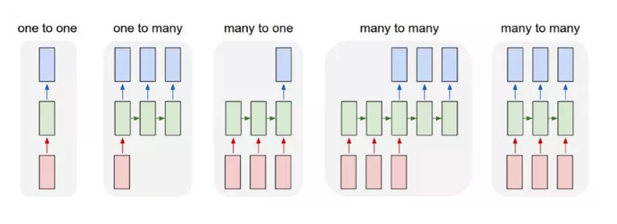

### Ứng Dụng và ví dụ

Để hiểu hơn về mô hình RNN ta lấy một ví dụ sau: Cho tập input x = [h,e,l,o], sử dụng mô hình RNN để tạo ra một từ có nghĩa. Ta sẽ encode các chữ cái dưới dạng one hot encoding.

Và kết quả như sau:

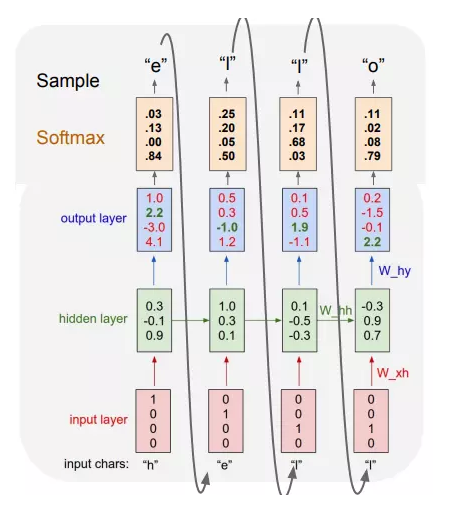
Ta thấy kí tự bắt đầu là "h" từ đó ta tìm ra chữ cái tiếp theo có xác suất lớn nhất là "e" và "e" tiếp tục trở thành input vào của cụm tiếp theo,... cứ như vậy cho đến khi tạo thành một từ có nghĩa, trong trường hợp này là từ "hello".
RNN được ứng dụng và thành công ở rất nhiều bài toán, đặc biệt là ở lĩnh vực NLP(xử lý ngôn ngữ tự nhiên). Trên lý thuyết thì đúng là RNN có khả năng nhớ được những tính toán (thông tin) ở trước nó, nhưng mô hình RNN truyền thống không thể nhớ được những bước ở xa do bị mất mát đạo hàm (sẽ được đề cập ở bài sau) nên những thành công của mô hình này chủ yếu đến từ một mô hình cải tiến khác là LSTM (Long Short-Term Memory, sẽ được đề cập ở những bài sau). LSTM về cơ bản cũng giống với RNN truyền thống ngoài việc thêm các cổng tính toán ở hidden layer để quyết định giữ lại các thông tin nào.

---

## 2. Gradient Vanishing

Vậy hiện tượng Vanishing Gradient là gì? Trước hết thì Backpropagation Algorithm (Thuật toán lan truyền ngược) là một kĩ thuật thường được sử dụng trong quá trình training. Ý tưởng chung của thuật toán là sẽ đi từ output layer đến input layer và tính toán gradient của hàm chi phí (cost function) tương ứng cho từng parameter/weights của mạng. Gradient descent được tính sau đó được sử dụng để cập nhật cho các parameter đó.
Toàn bộ quá trình trên sẽ được lặp đi lặp lại cho tới khi mà các parameter của network được hội tụ. Thông thường chúng ta sẽ có một hyperparameter (số Epoch - số lần mà training set được duyệt qua một lần và weights được cập nhật) định nghĩa cho số lượng vòng lặp để thực hiện quá trình này. Nếu số lượng vòng lặp quá nhỏ thì ta gặp phải trường hợp mạng có thể sẽ không cho ra kết quả tốt và ngược lại thời gian training sẽ lâu nếu số lượng vòng lặp quá lớn.

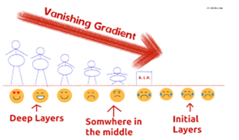

## 3. LSTM

LSTM (Long Short-Term Memory) là cải tiến của RNN, giúp **giải quyết vấn đề vanishing gradient** bằng cách thêm các cổng tính toán ở hidden layer để quyết định giữ lại thông tin nào.

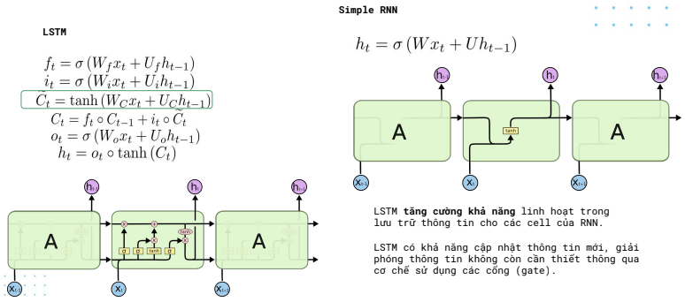

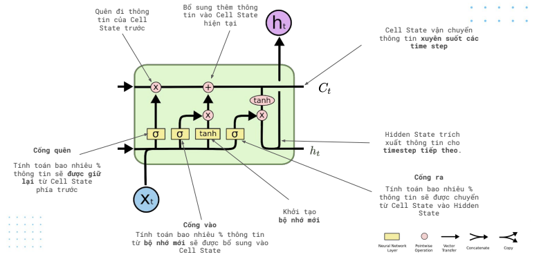

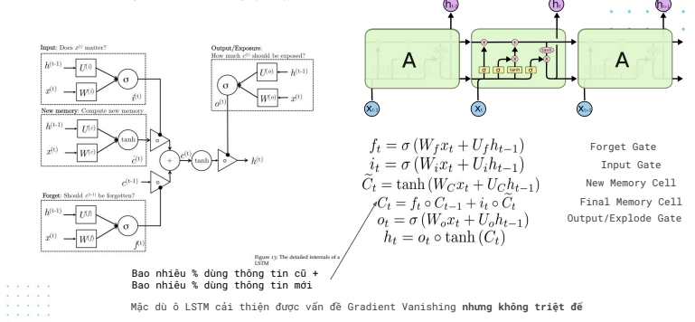

Kiến trúc của LSTM gồm 3 cổng: Forget Gate, Input Gate và Output Gate.

### Cổng Forget Gate

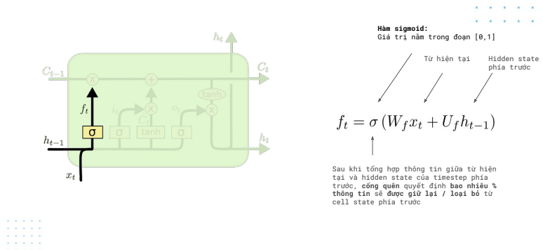

### Cổng Input Gate

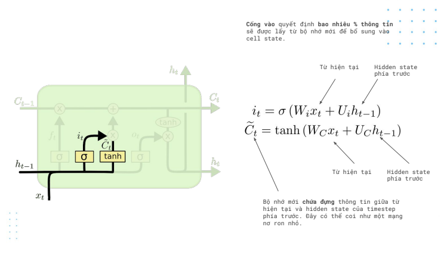

### Phép cập nhật

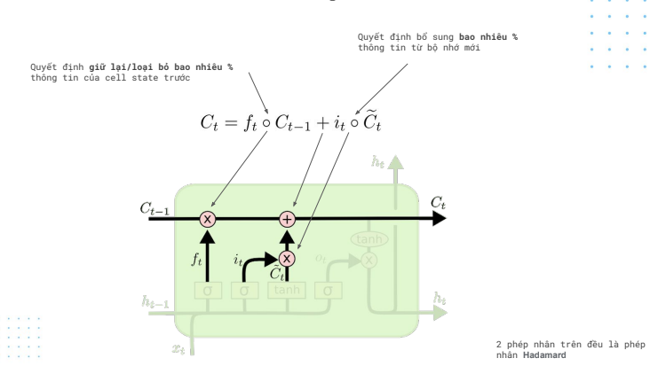

### Cổng Output Gate

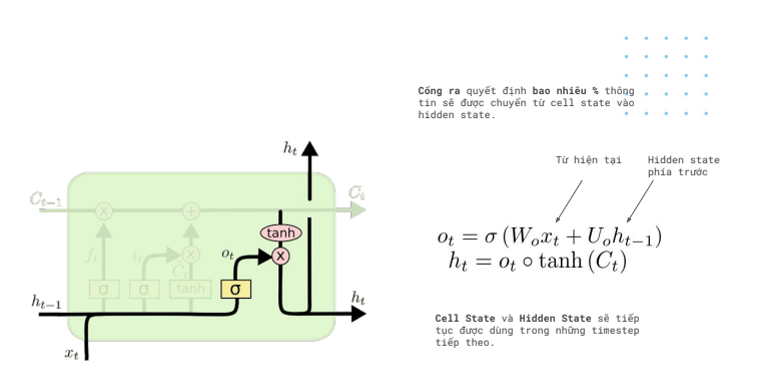

### Đưa quyết định

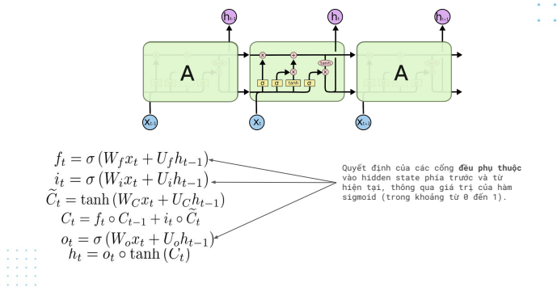

## 4. Seq2Seq Model

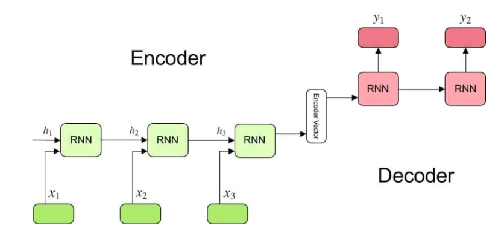

### Bộ mã hóa – Encoder

- Một ngăn xếp chứa các mạng con là phần tử của RNN (hoặc các ô nhớ của *LSTM* hay *GRU*) nơi nhận vào tín hiệu của một phần tử của chuỗi đầu vào và truyền tiếp về phía cuối mạng.  
- Trong bài toán hỏi đáp, chuỗi đầu vào là tập hợp tất cả các từ của câu hỏi. Mỗi từ được thể hiện bởi *xᵢ* với *i* là thứ tự của từ đó.  
- Các trạng thái ẩn *hᵢ* được tính với công thức:  

$$
h_t = f(W^{(hh)} h_{t-1} + W^{(hx)} x_t)
$$  

Công thức đơn giản này mô tả kết quả của một mạng nơ-ron hồi quy (RNN) thông thường. Như chúng ta có thể thấy, các trạng thái ẩn được tính bởi đầu vào tương ứng (*xₜ*) và trạng thái ẩn trước đó *hₜ₋₁*.  

### Véc tơ mã hóa trung gian – Encoder vector

- Đây là trạng thái ẩn nằm ở cuối chuỗi, được tính bởi bộ mã hóa, nó cũng được tính bởi công thức phía trên.  
- Véc tơ này có chức năng gói gọn thông tin của toàn bộ các phần tử đầu vào để giúp cho bộ mã hóa dự đoán thông tin chính xác hơn.  
- Véc tơ này sau đó hoạt động như trạng thái ẩn đầu tiên của bộ giải mã.  

### Bộ giải mã – Decoder

- Một ngăn xếp các mạng con là phần tử của RNN có nhiệm vụ dự đoán đầu ra *yₜ* tại thời điểm *t*.  
- Mỗi phần tử này nhận đầu vào là trạng thái ẩn trước đó và tạo kết quả đầu ra cũng như trạng thái ẩn của chính nó.  
- Trong bài toán hỏi đáp, chuỗi đầu ra là tập hợp các từ của câu trả lời. Mỗi từ được biểu diễn bởi *yᵢ* với *i* là thứ tự của từ.  
- Các trạng thái ẩn *hᵢ* được tính bởi công thức:  

$$
h_t = f(W^{(hh)} h_{t-1})
$$  

Như chúng ta thấy, các trạng thái ẩn được tính bởi trạng thái ngay trước đó.  

- Đầu ra *yₜ* tại thời điểm *t* được tính bởi công thức:  

$$
y_t = softmax(W^S h_t)
$$  

Chúng ta tính đầu ra sử dụng trạng thái ẩn tương ứng tại thời điểm hiện tại và nhân với trọng số tương ứng *W(S)*. *Softmax* được sử dụng để tạo ra véc tơ xác suất giúp chúng ta xác định đầu ra cuối cùng (VD: các từ trong bài toán hỏi đáp).  

Năng lực đặc biệt của mô hình này là nó có thể ánh xạ chuỗi đầu vào và chuỗi đầu ra có độ dài khác nhau. Vì thế, nó mở ra giải pháp cho một loạt các bài toán trong lĩnh vực này.

---

## 5. Teacher Forcing trong Huấn luyện

**Teacher Forcing** là một kỹ thuật được sử dụng trong quá trình huấn luyện các mạng nơ-ron nhân tạo. Kỹ thuật này được sử dụng phổ biến trong NLP.

### Teacher Forcing hoạt động như thế nào?

Để hiểu về cơ chế của kỹ thuật này, hãy cùng liên tưởng về các bài toán bạn phải giải hồi còn đi học. Chắc hẳn bạn đã gặp những bài toán có nhiều phần nhỏ mà kết quả của phần trước ảnh hưởng trực tiếp đến kết quả của phần sau. Nếu bạn làm sai phần đầu tiên thì nhiều khả năng bạn sẽ làm sai kết quả của toàn bài.

Các mô hình học máy của chúng ta cũng gặp phải vấn đề tương tự. Đặc biệt trong các bài toán **xử lý thông tin dạng chuỗi**, việc dự đoán sai một phần tử có thể làm cả chuỗi phía sau bị sai lệch theo. Teacher Forcing khắc phục sự phụ thuộc giữa các phần tử trong chuỗi bằng cách đánh giá mô hình trên từng phần của bài toán lớn. Đáp án của phần trước được cung cấp làm dữ kiện cho phần tiếp theo.

### Teacher Forcing có ưu và nhược gì?

*Teacher Forcing* giúp tăng tốc độ huấn luyện mô hình. Khi mới bắt đầu huấn luyện, mô hình có những dự đoán rất tồi. Nếu không sử dụng kỹ thuật này mô hình có thể sẽ bị lạc lối trong cả mớ các lựa chọn **thử-sai** cho đến khi ngẫu nhiên tìm được đáp án đúng. Với một chuỗi dài, thời gian để mô hình hội tụ sẽ tăng theo hàm mũ.

Mặc dù vậy, Teacher Forcing có thể làm cho mô hình bị phụ thuộc vào các thông tin hỗ trợ. Kết quả là khi hoạt động trong thực tế (hoặc đánh giá trên tập test), kết quả của mô hình có thể kém hơn một cách đáng kể.

---

