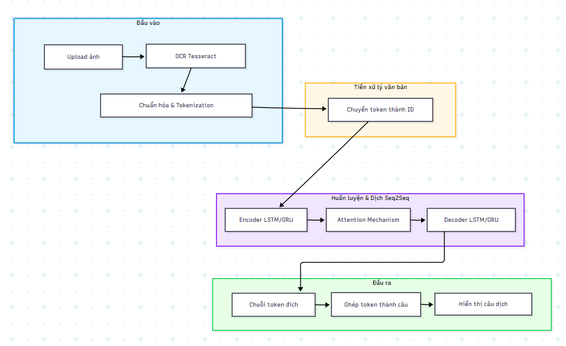

# Mô hình Dịch Máy

---

## 1. Các lý thuyết cơ bản

### 1.1. Nền tảng cơ bản (Machine Learning & Deep Learning)

Trước khi đụng đến Seq2Seq, bạn cần hiểu:

- **Học có giám sát (Supervised Learning):**
  - Dữ liệu huấn luyện có cặp (input → output).
  - Ví dụ: câu tiếng Việt → câu tiếng Anh.

- **Vector hóa dữ liệu (Embedding & One-hot encoding):**
  - Mỗi từ hoặc subword được biểu diễn bằng vector số.
  - Vì máy không hiểu chữ, chỉ hiểu số.

- **Mạng neural cơ bản:**
  - Cấu trúc neuron, hàm kích hoạt (ReLU, Sigmoid, Tanh).
  - Lan truyền xuôi (Forward pass) & lan truyền ngược (Backpropagation).

- **Loss function & Optimization:**
  - CrossEntropyLoss (cho bài toán phân loại nhiều lớp).
  - Adam optimizer, SGD.

## 2. Lý thuyết cốt lõi cho Seq2Seq

Đây là phần quan trọng nhất để làm mô hình dịch:

### 2.1. Recurrent Neural Network (RNN)
- Cách xử lý chuỗi dữ liệu (từng token một).
- Vấn đề gradient vanish/explode.

### 2.2. LSTM (Long Short-Term Memory) & GRU
- LSTM có bộ nhớ dài hạn giúp lưu ngữ cảnh câu.
  - Cấu trúc: input gate, forget gate, output gate.
- GRU: đơn giản hơn nhưng hiệu quả tương đương.

### 2.3. Kiến trúc Seq2Seq (Encoder – Decoder)
- **Encoder:** Đọc toàn bộ câu nguồn, xuất ra trạng thái ẩn (hidden state).
- **Decoder:** Dựa vào trạng thái ẩn để sinh câu đích từng token.

### 2.4. Teacher Forcing
- Trong huấn luyện, đôi khi dùng từ đúng ở bước trước để sinh từ tiếp theo.
- Giúp mô hình học nhanh hơn.

### 2.5. Attention Mechanism
- Giải quyết hạn chế “bottleneck” của Seq2Seq truyền thống.
- Cho phép decoder “nhìn” vào các phần khác nhau của câu nguồn khi dịch.
- Các loại attention phổ biến: Bahdanau, Luong.

---

## 3. Mở rộng 
### 3.1. OCR (Optical Character Recognition)
- **Tesseract OCR:** open-source, dễ dùng.
- **Pipeline OCR:**
  - Tiền xử lý ảnh (OpenCV: chuyển grayscale, threshold).
  - Nhận dạng text.
  - Hậu xử lý text (xóa ký tự lỗi).

### 3.2. Tiền xử lý ngôn ngữ (Text Preprocessing)
- Tokenization (Word, Subword – Byte Pair Encoding, SentencePiece).
- Lowercasing, xóa ký tự thừa, padding.

### 3.3. Evaluation cho Machine Translation
- **BLEU score:** đo độ chính xác dịch.
- **chrF, METEOR:** các chỉ số đánh giá khác.

---

